---
### The production site is available at https://failte.app
---
# Table of Contents

- [Project Background](#project-background)
- [User Experience](#user-experience)
  - [Design](#design)
  - [Site Structure](#site-structure)
  - [Features](#features)
    - [First Visit](#first-visit)
    - [Navigation Bar](#navigation-bar)
    - [Interactive Map](#interactive-map)
    - [Search](#search)
    - [Geo Guessing Game](#geo-guessing-game)
    - [About](#about)
    - [Contact](#contact)
    - [Footer](#footer)
    - [Mobile UX](#mobile-ux)
    - [Accessibility](#accessibility)
- [Technologies Used](#technologies-used)
- [Bugs and Issues](#bugs-and-issues)
  - [Resolved](#resolved)
  - [Unresolved](#unresolved)
- [Testing](#testing)
  - [Overview](#overview)
  - [Testing Process](#testing-process)
  - [Responsiveness](#responsiveness)
  - [Accessibility Testing](#accessibility-testing)
- [Roadmap](#roadmap)
- [Deployment](#deployment)
  - [Google Maps API Key](#google-maps-api-key)
  - [EmailJS](#emailjs)
  - [Steps for deployment on AWS](#steps-for-deployment-on-aws)
  - [Steps for cloning the repository](#steps-for-cloning-the-repository)
  - [Steps for forking the repository](#steps-for-forking-the-repository)
- [Credits](#credits)
  - [Assets](#assets)
  - [Tools & Utilities](#tools--utilities)
  - [Educational Resources](#educational-resources)

---
# Project Background

fáilte is a site that aims to make it easy for users to find and discover attractions in Ireland. The site features an interactive map which has over 600 attractions plotted, along with a geo-guessing game where users can test their knowledge of Ireland's attractions.

With the rising popularity of staycations, people require easy access to information that helps them make the most of their trips and explore their surroundings. The project's primary objectives include creating a user-friendly platform for browsing various attractions in Ireland, such as historic sites, nature reserves, museums, art galleries, and other points of interest. Additionally, it aims to provide information about specific attractions and directions to navigate to them.

The key goals for this project include providing a user-friendly experience for browsing attractions in Ireland, including historic sites, nature reserves, museums, art galleries and other points of interest. Additionally it aims to make it easy for users to find out more about an attraction of interest and find directions to navigate to the attraction.

---

# User Experience

## Design

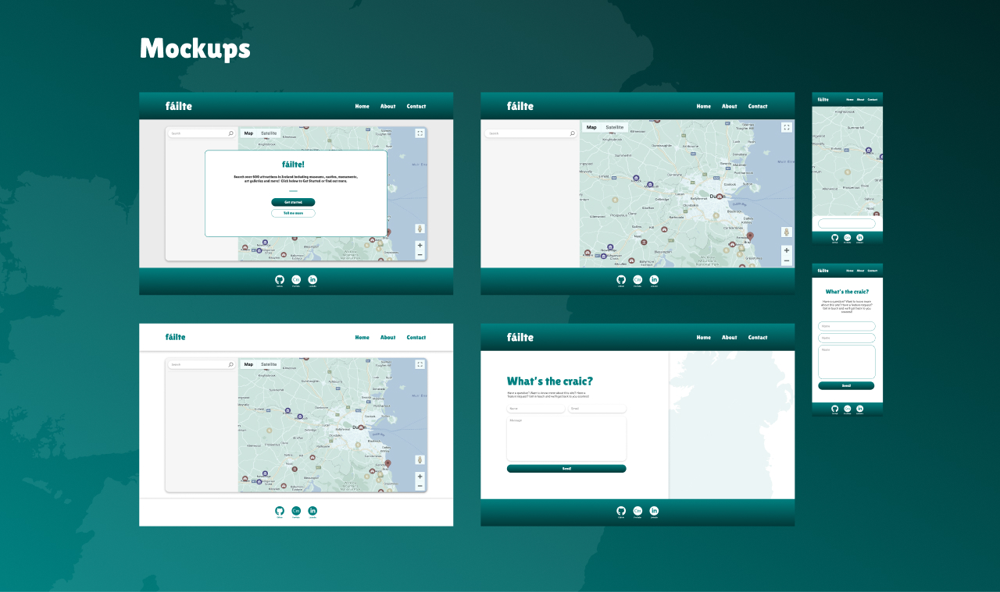
- To guide the development process, mockups of the intended design were created in Figma before starting development. These early designs provided clear direction for development, however the final build may differ as various iterations were explored throughout the development.
- A simple colour palette was used consisting of a green primary colour, inspired by Ireland's national colour, along with a spectrum of gray to white. 
- Lilita One was the chosen typeface for headings as it conveys a sense of welcome (fáilte) and friendliness, while Roboto was used for body text for its simple and modern appearance.
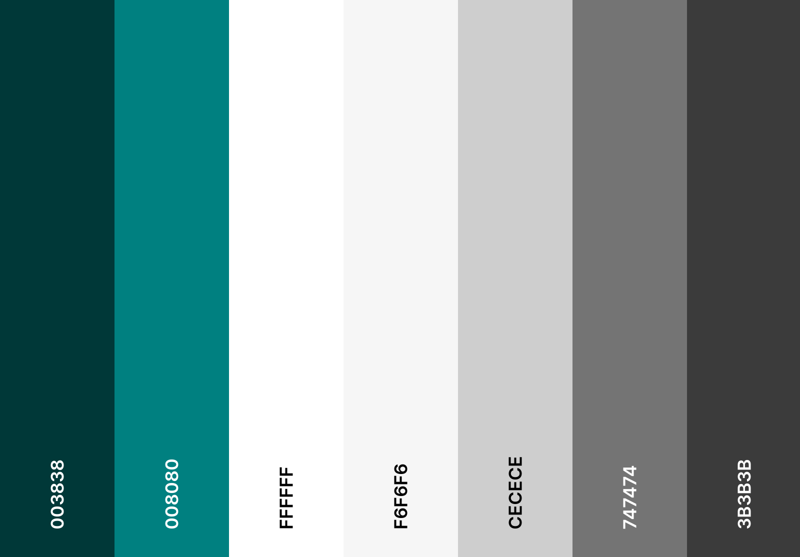
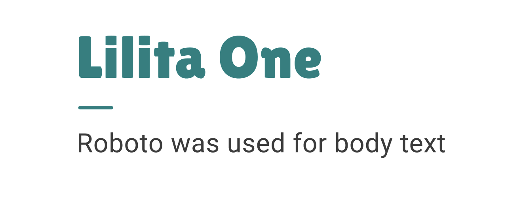

## Site Structure

- **fáilte** has four pages:
    - The '[Map](https://www.failte.app/index.html)' page contains the primary feature of the site - an interactive map showing 600+ attractions, with a search input feature.
    - The '[Play](https://www.failte.app/play.html)' page features a geo-guessing game where users can test their knowledge of Ireland's attractions.
    - The '[About](https://www.failte.app/about.html)' page contains a short description of the site and its purpose. Additionally it includes an attribution statement to credit Fáilte Ireland for the data used for the site.
    - The '[Contact](https://www.failte.app/contact.html)' page allows users to contact the site owner (myself) with feedback, questions and suggestions.
    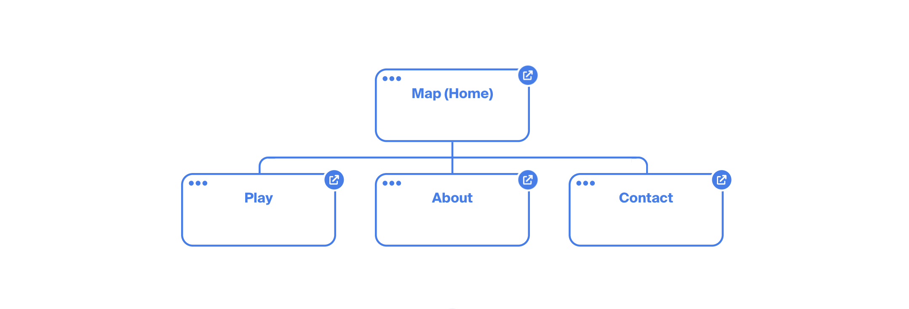

## Features

### First Visit

- The main app checks the `window.localStorage` property to check if it's the user's first time visiting the site. On first visit, a modal is shown to provide some context on what fáilte is and CTA's are provided to allow users to easily navigate to the About page to read more before interacting with the Map.
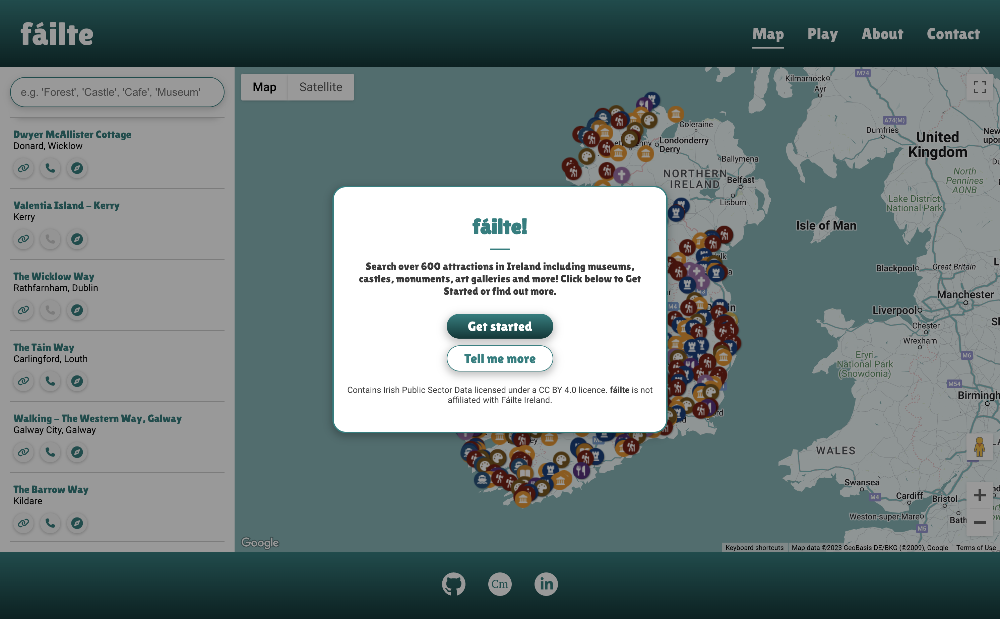

### Navigation Bar

- The site features a responsive navigation bar which includes links to each page. 
- Clicking the **fáilte** logo brings users to the Home/Map page in line with UX best practice.
- The active page a user is on is highlighted with a decorative underline to help orient the user as they navigate the site.

### Interactive Map

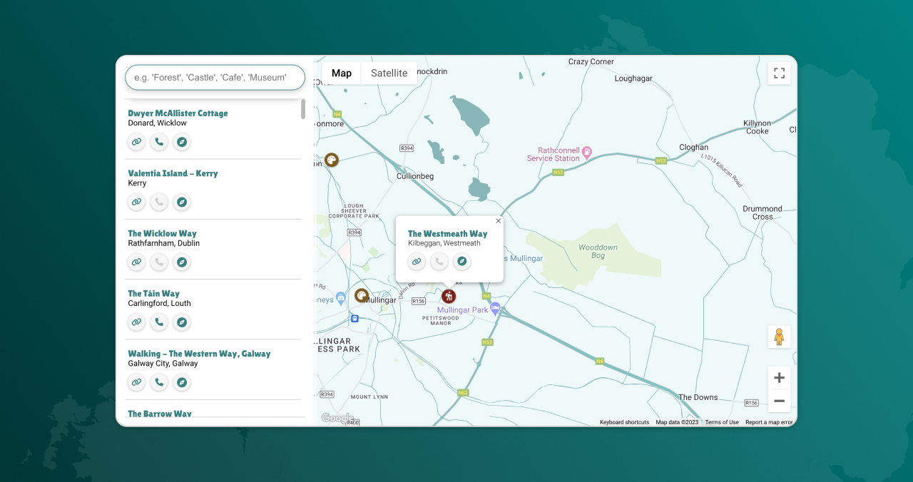
- The Map utilises the [Google Maps JavaScript API](https://developers.google.com/maps/documentation/javascript/overview) along with attraction data provided by the [Fáilte Ireland OpenData API](https://failteireland.developer.azure-api.net/api-details#api=opendata-api-v1&operation=attractions-csv) which includes the name, address, phone number, website and geographical coordinates for 622 attractions in Ireland.
- Users can pan and zoom around the Map using the mouse, keyboard or on-screen controls. Additionally, the Map includes native Google Maps controls such as Street View, Satellite view, zoom and fullscreen.
- The Map features a set of marker icons which denote the type of attraction i.e. museum, forest, hike, cafe etc. and are colour coded for readability.
- When a marker is clicked, an info window displays above the marker with the name and location of the attraction, as well as a link to a website, phone number and Google Maps directions. If the attraction has no website or phone number, the buttons are greyed out and are unclickable.
- Users can click the 'close' button or click anywhere outside the info window, to close it. The active info window will also close if another is opened.

### Search 

- Users can use the Search function to search for specific attractions.
- The Search works by checking the name, location and "tags" associated with each attraction against the user's search query. Most attractions have multiple tags (e.g. "Castle, Forest, Museum") which is why a search for "Castle" may also show other types of attractions.
- The Search results dynamically update as the user types and is quick and responsive to user input.
- If an invalid search query is entered, an error message is displayed prompting the user to enter a new search query.
- The Search Results show the same information, including links and buttons, as the info windows on each map marker.

### Geo Guessing Game

- fáilte features a Geo Guessing Game that provides users a fun way to discover Ireland's attractions.
- Users are dropped at a random Street View of a popular attraction in Ireland and must guess the location by clicking on the map. 
- The closer the user's guess, the more points they win, over the course of a five round game.
- The game can be enjoyed by users of various abilities as it features keyboard controls ([see Accessibility](#accessibility)).

### About

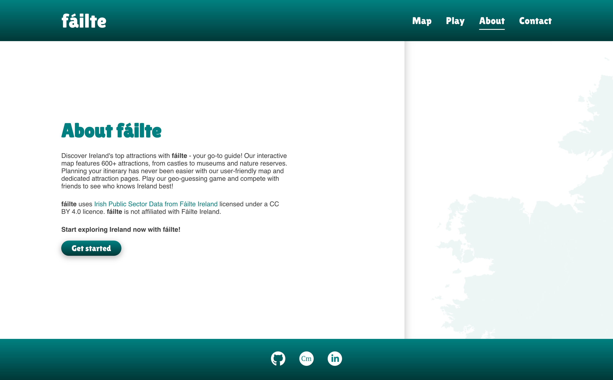
- The site features an About page which provides more information on what fáilte is and how users can utilise it.
- An attribution statement is also provided to credit the attraction data source ([Fáilte Ireland](https://data.gov.ie/organization/failte-ireland)).
- A "Get started" CTA is shown at the end of the About content to enable users to easily navigate to the Map after reading about the site.

### Contact

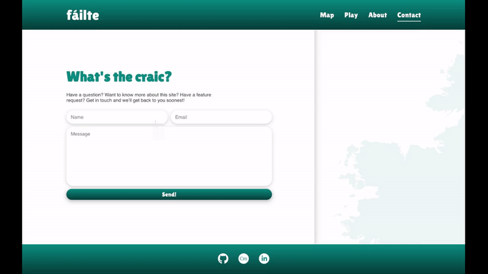
- A functional contact form is provided to allow users to submit feedback, messages etc.
- On successful submission, a feedback popup is shown to tell the user the message has been sent.
- If unsuccessful, an error message displays, prompting the user to try again.

### Footer

- The site footer features three of my personal links to allow users to easily get in touch with me or to view my work: [GitHub](https://github.com/CarlMurray); [Portfolio](www.carlmurray.design); [LinkedIn](https://www.linkedin.com/in/carljmurray).

### Mobile UX

- On mobile screens, the Map and Play pages are designed to fit within the browser's viewport at all times, taking native browser UI elements into account. This was accomplished by using DVH ([Dynamic Viewport Units](https://css-tricks.com/the-large-small-and-dynamic-viewports/)) in CSS rules.
- This was intentionally done so that no scrolling is necessary and the Map and Play features are always visible on screen, and are easy to interact with, without the possibility of unintentional (and frustrating) scrolling as users try to navigate the Map or Street View, particularly on touch screens.
- Map and Street View controls are also hidden on mobile screens to preserve screen real estate, with the exception of the fullscreen control which is of particular importance on small screens (fullscreen not available on iOS, see [Bug #8](#bugs-and-issues)).
- On the Map and Play pages, layouts are designed to adapt for optimal usability on small screens. For example, on the Map page, Search Results are hidden in a bottom-drawer on small screens. Additionally, on the Play page, the layout of Street View and the Map change based on the aspect ratio of the screen to make the most of the available screen space (i.e. side-by-side vs. vertically stacked Map/Street View)
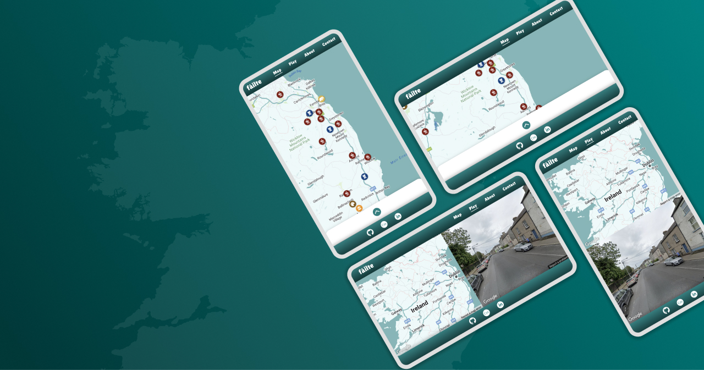

### Accessibility

- Designing for users with disabilities was an important goal of this project, and steps were taken to ensure that fáilte can be enjoyed by users of varying abilities. 
- The Map is navigable with keyboard controls and all attractions on the map and search results can be cycled through with keyboard navigation. 
- All attraction icons on the Map, along with their associated links, have aria-labels and/or titles so users of screen readers can use the Map.
- The Geo Guessing Game can be enjoyed by keyboard users too, as it features optional keyboard controls which show a red crosshair at the center of the map and allow users to make a guess by using an on-screen button.
- Unfortunately, some aspects of fáilte, such as the Game, are not accessible by all users (such as those with total blindness or significant visual impairment). However, a long term goal is to make fáilte truly accessible for all.
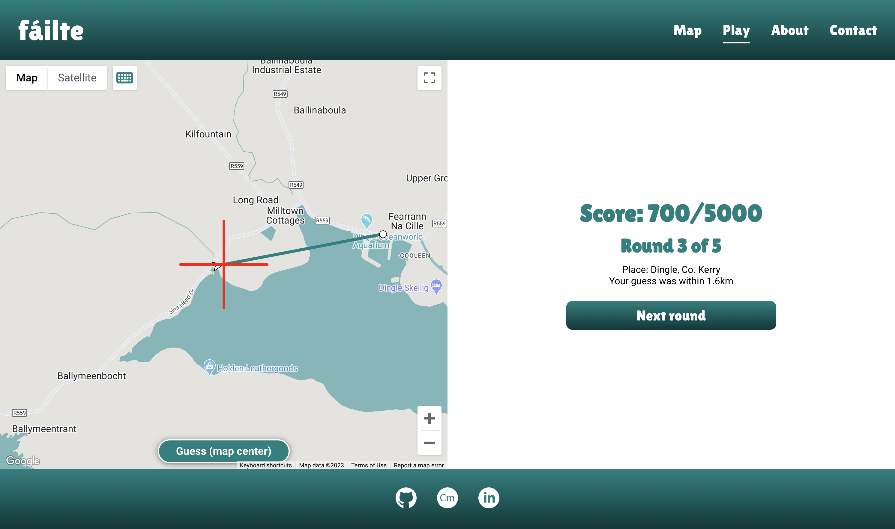

---

# Technologies Used

I used the following technologies, platforms and support in building my project:
- Wireframes and mockups were designed in [Figma](https://www.figma.com/)
- The website is built with [HTML](https://html.spec.whatwg.org/), [CSS](https://www.w3.org/Style/CSS/Overview.en.html) and [JavaScript](https://www.ecma-international.org/publications-and-standards/standards/ecma-262/)
- [Stack Overflow](https://stackoverflow.com/) was used for troubleshooting and debugging throughout the project, as referenced.
- [MacOS VoiceOver](https://bbc.github.io/accessibility-news-and-you/assistive-technology/testing-steps/voiceover-mac.html) was used for accessibility testing.
- [Git](https://git-scm.com/) was used for version control
- [GitHub](https://github.com/) was used for the project repository
- [Google Fonts](https://fonts.google.com/) was used for all fonts on the site
- [FontAwesome](https://fontawesome.com/v4/) was used for icons which then had additional styling applied to them
- [Favicon Generator](https://favicon.io) was used to generate the favicon used
- The site is hosted on [AWS Amplify](https://aws.amazon.com/amplify/)
- Custom domain registered with [NameCheap](https://www.namecheap.com/) (https://failte.app)
- The [Google Maps JavaScript API]() was used for the Map and Street View functionality.
- The [Fáilte Ireland OpenData API](https://failteireland.developer.azure-api.net/api-details#api=opendata-api-v1&operation=attractions-csv) was used for attraction data.
- [EmailJS](https://www.emailjs.com/) was used to add functionality to the Contact form.

---

# Bugs and Issues

## Resolved

1. During the initial stage of development, when fetching the Attraction Data from the Fáilte Ireland API, it would only return a maximum of 50 results as results are paginated. Documentation for the API is non-existant/inaccessible at time of writing and I could not determine a solution. However, I was able to download the full dataset in CSV format which I could then parse to JSON using [CSVtoJSON](https://csvjson.com/csv2json) and `fetch` the file locally which turned out to be a simpler and better solution.
2. The biggest challenge was implementing the search feature so that it functions as desired. During development, I was able to make Attractions which matched the search query appear on the map, however when I cleared or editted the search input, the Attractions remained on the map as I had not told the program to clear the map when a new search query is made. Drawing up a flowchart helped me think through the logic of my code and the issue and solution became obvious after doing this.

3. When testing on an iPhone XS Max, it was noted that the site did not fit within the viewport as intended. This was due to `vh` units not taking into account the native browser UI elements such as the toolbar etc. I found a solution on [Stack Overflow](https://stackoverflow.com/questions/58886797/how-to-access-the-real-100vh-on-ios-in-css): a newer CSS unit - `dvh` (Dynamic Viewport Units) - takes into account the browser UI and changing any `vh` units in my CSS to `dvh` fixed this issue and the site now displays as intended. This was tested on all major mobile browsers (Chrome, Edge, Safari, Firefox, Opera, DuckDuckGo) wihtout issue.

4. After implementing the search functionality, I tested it on an iPhone XS Max and it would not return any search results. I found that the iPhone keyboard was automatically setting the first character to uppercase, and I had not made the search query function case-insensitive. This was fixed by simply adding `.toLowerCase()` to the `searchQuery` argument in my app.
")
5. When implementing the geo-guessing game, on occasion the app was trying to load a non-existent Street View at a Lat/Long location that did not have Street View on Maps (e.g. on private property or an inaccessible attraction). To fix this bug, I first had to study the Maps API Documentation more thoroughly and re-write my functions to allow for reading the promise response after checking the status of the Street View request. I then wrote logic that would check if the Street View is valid, and if not, try again.
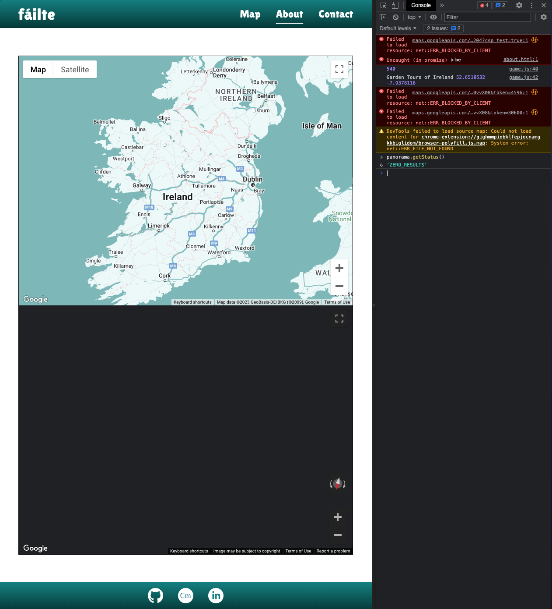
6. When testing the Geo Guessing Game during development, after 3-4 rounds a number of errors started to appear in console, particularly relating to WebGL contexts, before the game would eventually stop working. After some research, I found that the issue was due to my code initialising the Street View each time the game started a new round which consumed excess browser resources, rather than re-using the same Street View and changing the Panorama. The fix was to stop re-initialising Street View and instead write a function that would update the Street View with a new Panorama each round.
[Relevant Stack Overflow Thread](https://stackoverflow.com/questions/45654166/reuse-a-google-maps-street-view-inside-of-a-modal)
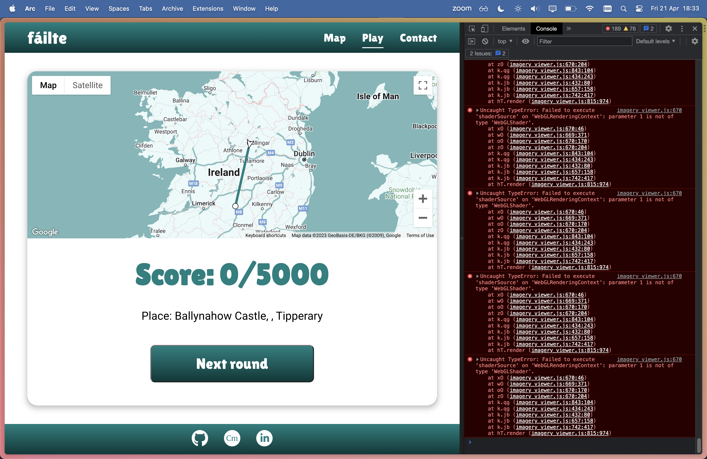
7. When testing the site towards the end of development, I noticed a bug in the Geo Guessing Game where every 5 - 10 rounds, the Street View would not update and users were shown a stale Street View even though a new Map position was generated, similar to bug #5. This was a challenging bug to diagnose and there were a couple of occasions where I mistakenly thought I had fixed it, but I believe it relates to the Lat/Lng coordinates in the Fáilte Ireland dataset - some locations do not have a valid Street View. I also think that fixing bug #6 led to this bug arising. To fix this bug, I created my own dataset with locations for the game in `geo-guess-locations.json`. This served two purposes: 1. It fixed the bug as I chose locations that I was able to verify had a valid Street View; 2. It fixed the issue of the game being too difficult as it now shows popular and familiar locations in Ireland rather than obscure locations that are too hard to guess.
8. During testing I noticed the fullscreen control was not showing on Map or Street View. After some troubleshooting, I learned from the Google Maps JavaScript API Documentation that iOS does not support fullscreen. [Reference](https://developers.google.com/maps/documentation/javascript/controls#:~:text=The%20Fullscreen%20control%20offers%20the,not%20visible%20on%20iOS%20devices.)

## Unresolved

1. On initial load of the Geo Guessing Game, if the user enables the Keyboard Controls, the "Guess" button initially displays off-center. I could not diagnose the issue, however the button shifts to it's intended position once the user interacts with the Map (pan/zoom) and as such, does not have any significant impact on performance, usability or functionality.
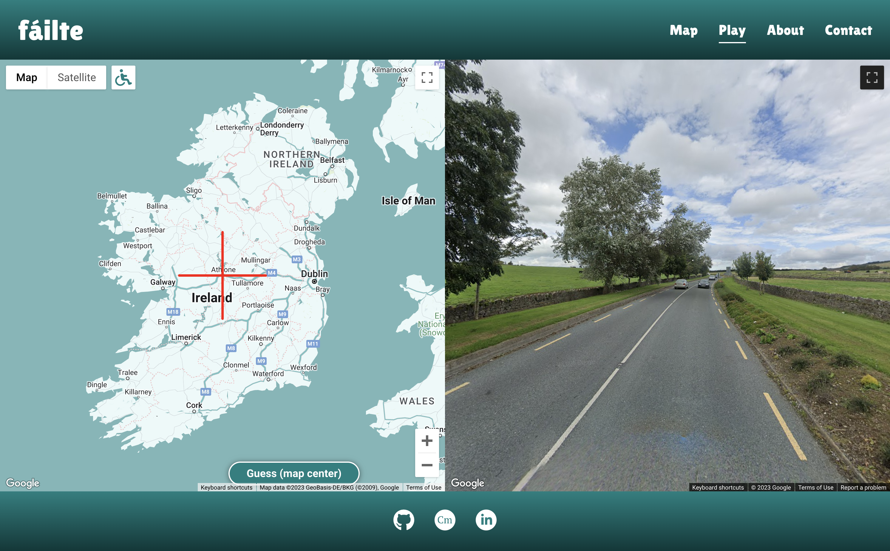

---

# Testing

## Overview

- Responsiveness was tested as per below table (go to section: [Responsiveness](#responsiveness))
- All HTML files were passed through the W3C validator with no errors (Validation results: [Home page](https://validator.w3.org/nu/?doc=https://failte.carlmurray.design/), [Game page](https://validator.w3.org/nu/?doc=https://failte.carlmurray.design/play.html), [About page](https://validator.w3.org/nu/?doc=https://failte.carlmurray.design/about.html), [Contact page](https://validator.w3.org/nu/?doc=https://failte.carlmurray.design/contact.html) )
- The CSS stylesheet was passed through the W3C validator with no errors ([Validation of styles.css](https://jigsaw.w3.org/css-validator/validator?uri=https://failte.carlmurray.design/assets/css/styles.css&profile=css3svg&usermedium=all&warning=1&vextwarning=&lang=en))
- All JavaScript files were passed through JSHint with no errors present.
- The website was tested on major browsers including Chrome, Safari, Firefox and Edge as detailed in [Testing Process](#testing-process) below.
- All user flows were tested in depth including navigating through content, entering search queries, clicking CTAs and links, and form submission.
- All forms were tested to ensure validation was present and that forms could be submitted without error
- Lighthouse was used to test for Performance, Accessibility, Best Practices and SEO and adjustments were made to improve test results. 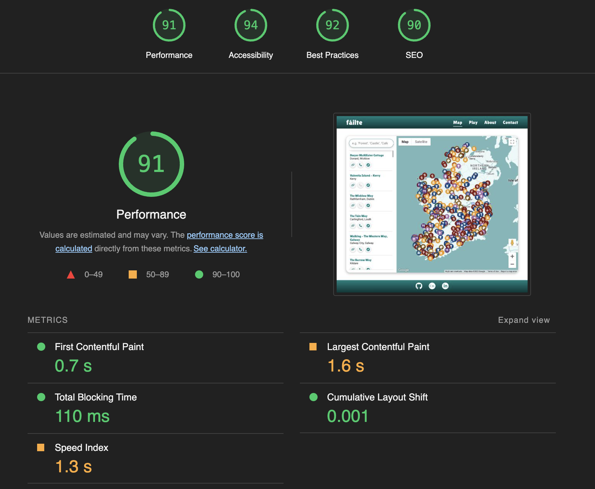

## Testing Process

| Test                | Action                   | Success Criteria  |
| -------------       |-------------             | -----|
| Homepage loads      | Navigate to website URL  | Page loads < 3s, no errors |
| Game                | Play 50 rounds of game  | Locations not repeated until all have been shown once, correct map and street view shown, interactivity functions as intended |
| Links               | Click on each Navigation link, CTA, button, logo, footer link, attraction links   | Correct page is loaded/correct action performed, new tab opened if applicable |
| Attraction links    | Verify invalid links are not clickable, correct button style applied, correct title shown on hover, check info windows and search results views   | Invalid links not clickable, grey icon shown, correct title shown on hover |
| Form validation     | Enter data into each input field, ensure only valid data is accepted | Form doesn't submit until correct data entered, error message shown |
| Successful Contact form submission     | Complete contact form and submit | Form successfully submits, feedback message shown |
| Unsuccessful Contact form submission     | Complete contact form, disable network connection and submit | Form submission fails, error message shown |
| Responsiveness      | Resize viewport window from 320px upwards with Chrome Dev Tools. Test devices as detailed in [Testing Process](#testing-process) | Page layout remains intact and adapts to screen size as intended |
| Accessibility       | Navigate the site with keyboard and screen reader | Tab index works in correct order, map is navigable, game is playable with keyboard controls enabled, content/aria-labels read aloud |
| Lighthouse          | Perform Lighthouse test on each page | Score of > 89 on Performance, Accessibility, Best Practices, SEO |
| Browser compatibility | Test links, layout, appearance, functionality and above Tests on Chrome, Safari, Firefox and Edge. | Website looks and functions as intended and passes all tests above

## Responsiveness

- Testing for responsiveness was conducted using Chrome Dev Tools and ResponsivelyApp.
- The website was tested extensively on a range of emulated mobile, tablet and large format screen sizes in both portrait and landscape orientations.

|Device            |Galaxy S8+|iPhone SE|iPhone X|Galaxy S21 Plus|iPhone 12 Pro|Galaxy S20 Ultra|iPhone 6/7/8 Plus|iPhone XR|iPad Mini|iPad Air|iPad Pro |Macbook Pro|
|------------------|----------|---------|--------|---------------|-------------|----------------|-----------------|---------|---------|--------|---------|-----------|
|**Resolution**    |**360x740**|**375x667**|**375x812**|**384x854**|**390x844**|**412x915**|**414x76**|**414x896**|**768x1024**|**820x1180**|**1024x1366**|**1440x900**|
|Render            |Pass      |Pass     |Pass    |Pass           |Pass         |Pass            |Pass             |Pass     |Pass     |Pass    |Pass     |Pass       |
|Layout            |Pass      |Pass     |Pass    |Pass           |Pass         |Pass            |Pass             |Pass     |Pass     |Pass    |Pass     |Pass       |
|Functionality     |Pass      |Pass     |Pass    |Pass           |Pass         |Pass            |Pass             |Pass     |Pass     |Pass    |Pass     |Pass       |
|Links             |Pass      |Pass     |Pass    |Pass           |Pass         |Pass            |Pass             |Pass     |Pass     |Pass    |Pass     |Pass       |
|Images            |Pass      |Pass     |Pass    |Pass           |Pass         |Pass            |Pass             |Pass     |Pass     |Pass    |Pass     |Pass       |
|Portrait/Landscape|Pass      |Pass     |Pass    |Pass           |Pass         |Pass            |Pass             |Pass     |Pass     |Pass    |Pass     |Pass       |

*Testing using ResponsivelyApp:*
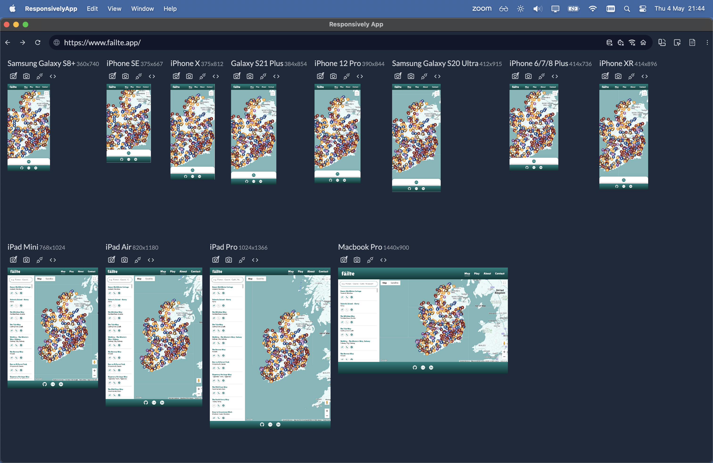

### Accessibility Testing

- Accessibility testing was conducted by navigating the site and performing tasks using keyboard navigation and a screen reader (MacOS VoiceOver)
- The site was audited using [WAVE Web Accessibility Evaluation Tool](https://wave.webaim.org/) to evaluate implementation of best practices and accessibility guidelines.
- Informal usability testing of the site was conducted with a legally blind participant using a screenreader (MacOS VoiceOver) and keyboard navigation. 

##### Key findings and actions taken include:

| Finding | Action |
| --- | --- |
| The International Symbol of Access (Wheelchair Symbol) is sometimes seen as a symbol of exclusion rather than inclusion, particularly for people with disabilites that do not use a wheelchair, and the symbol does not represent a diverse range of disabilities and accessibility needs. ([reference](https://svknyc.com/journal/2017/06/wheelchair-icon-not-symbol-accessibility/)) | The symbol was changed to a Keyboard symbol to better represent the intent of the feature |
| The Keyboard controls were initially referred to as "Accessible" controls, however this gave the participant the impression that the feature would enable them to enjoy the game, which was not the case. The word "accessible" means that it should be usable by people of all abilities, and should not exclude people with certain disabilities. | The wording was modified to say "Keyboard Controls" as the feature still requires a certain level of visual ability to play the game. |
| When using keyboard navigation, certain elements were selectable which should not be. For example, when the first-visit modal is shown, users can tab through the rest of the site in the background. A similar issue occurs on the Game intro page where users can select the Map/StreetView even though it is not visible. | Code modified to ensure only visible/intended elements can be selected with keyboard navigation. |

In general, the participant reported that the site was quite user-friendly for users of keyboard navigation and screen readers as a result of proper semantic markup, use of headers, titles and aria-attributes, which made the site easy to navigate and comprehend.

---

# Roadmap
- Add more popular attractions to game dataset
- Improve search function to allow multiple keywords and locations to be entered
- Add search filter options to allow users to filter attractions by type, location etc.
- Add game options including difficulty, number of rounds, high score, location boundaries
- Add Activities and Accomodation datasets from Fáilte Ireland OpenData API

---

# Deployment

- The GitHub repository was connected to AWS Amplify for hosting.
- Custom domain (https://failte.app) was added with an SSL certificate on AWS Amplify.
- __The production site is available at https://failte.app

### Google Maps API Key

- Note: The API key in this repository is restricted and will not work outside of the repository.
- You must sign up to Google Cloud Platform and generate your own API key.
- Follow instructions [here](https://developers.google.com/maps/documentation/javascript/get-api-key)

### EmailJS

- Note: EmailJS is used for contact form functionality and will not work outside of the repository. 
- You must sign up to EmailJS and generate your own credentials.
- Follow instructions [here](https://www.emailjs.com/docs/tutorial/overview/)

### Steps for deployment on AWS:

- Navigate to AWS Amplify dashboard (sign-up required)
- Select "New app" - "Host Web App"

- Connect GitHub 

- Select repository, main branch

- Click checkbox and then Next

- Click "Save and deploy"

- Optional: Add a custom domain through the "Domain management" tab

### Steps for cloning the repository

1. Click on the "Code" button near the top right corner of the page.
2. Copy the HTTPS or SSH URL that appears in the box.
3. Open your terminal (or Git Bash on Windows) and navigate to the directory where you want to clone the repository.
4. Type "git clone" followed by a space, and then paste the URL you copied in step 3.
5. Press enter to run the command. This will clone the repository onto your local machine.
6. You should now have a local copy of the GitHub repository on your machine.

### Steps for forking the repository

1. Click the "Fork" button near the top right corner of the page. This will create a copy of the repository in your own GitHub account.
2. Once the fork is complete, you will be redirected to the forked repository in your account.
3. If you haven't already, clone the forked repository to your local machine using the steps outlined in the previous answer.
4. Make any changes or additions you want to the code in your local copy of the repository.
5. Commit your changes to your local repository using the "git commit" command.
6. Push your changes to the forked repository on GitHub using the "git push" command.
7. If you want to contribute your changes back to the original repository, create a pull request by going to the original repository's page and clicking the "New pull request" button. From there, you can compare your changes to the original repository and request that they be merged.
8. You should now have a forked copy of the GitHub repository in your account, and you can make changes to it and contribute back to the original repository if desired.

---

# Credits

### Assets

- Attraction data: [Fáilte Ireland OpenData API](https://failteireland.developer.azure-api.net/api-details#api=opendata-api-v1&operation=attractions-csv)
- Map & Street View: [Google Maps JavaScript API](https://developers.google.com/maps)
- Favicon: [Favicon.io](https://favicon.io/)
- Icons: [Font Awesome](https://fontawesome.com/)
- Ireland Image (Contact/About page): [MapSVG](https://mapsvg.com/maps/ireland)

### Tools & Utilities

- Responsiveness Testing: [ResponsivelyApp](https://responsively.app/)
- Accessibility Testing: [WAVE Web Accessibility Evaluation Tool](https://wave.webaim.org/)
- Flow Diagram: [SmartDraw](https://cloud.smartdraw.com/)
- Code Snippet README Images: [Carbon](https://carbon.now.sh/)
- Contact form submission: [EmailJS](https://www.emailjs.com/)

### Educational Resources

- [MDN Documentation](https://developer.mozilla.org/en-US/)
- [Working with Data and APIs in JavaScript, The Coding Train](https://www.youtube.com/watch?v=DbcLg8nRWEg&list=PLRqwX-V7Uu6YxDKpFzf_2D84p0cyk4T7X)
- [Google Maps API JavaScript Tutorial, Traversy Media](https://www.youtube.com/watch?v=Zxf1mnP5zcw&ab_channel=TraversyMedia)
- [The Web Developer Bootcamp 2023, Colt Steele](https://www.udemy.com/course/the-web-developer-bootcamp/)
- [Google Maps JavaScript API Documentation](https://developers.google.com/maps/documentation/javascript)